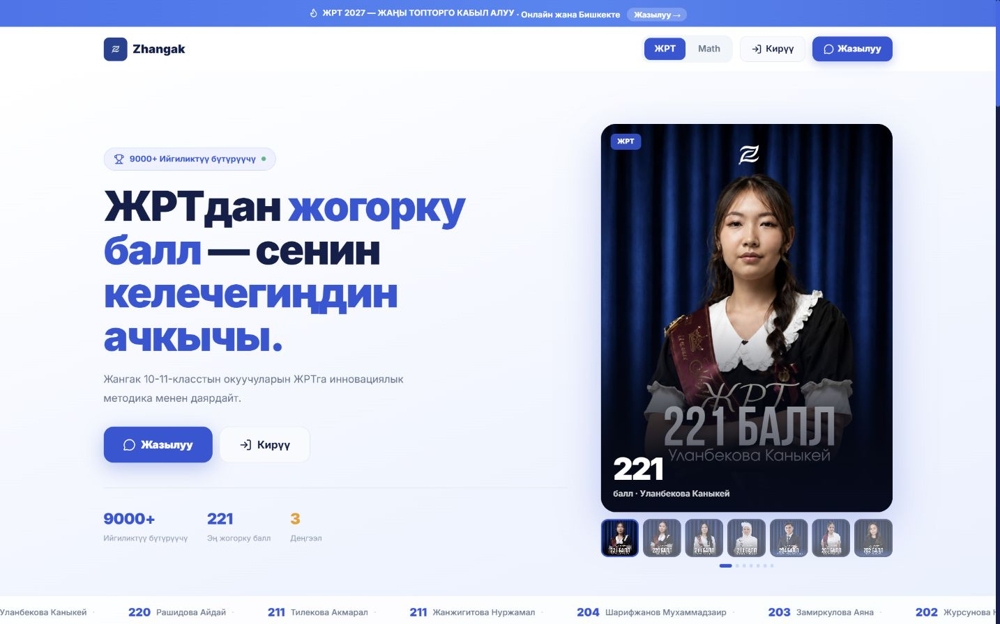
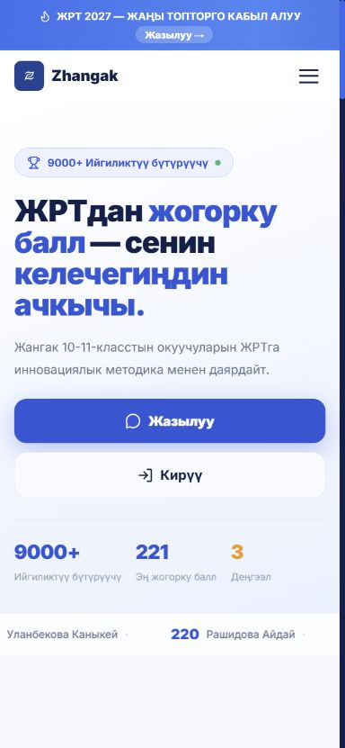
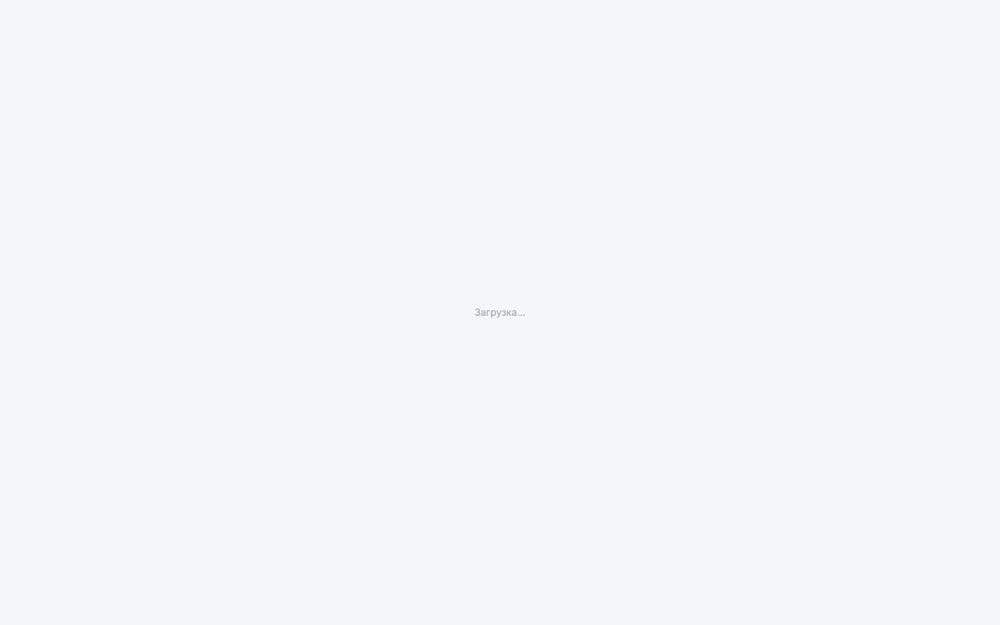
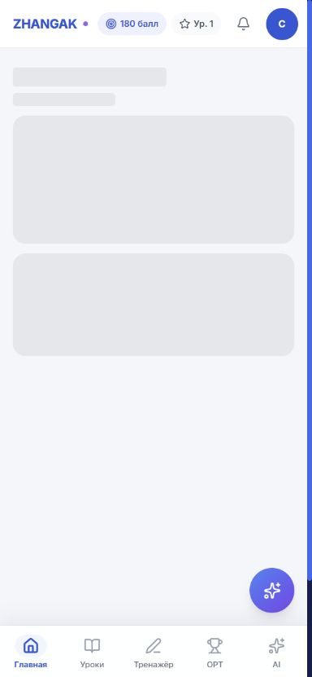
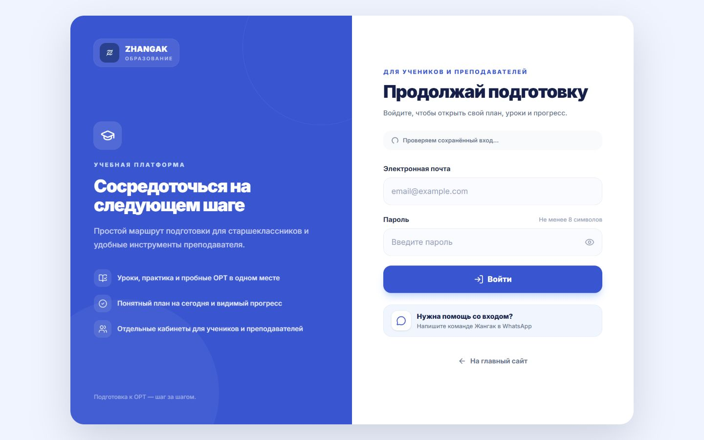
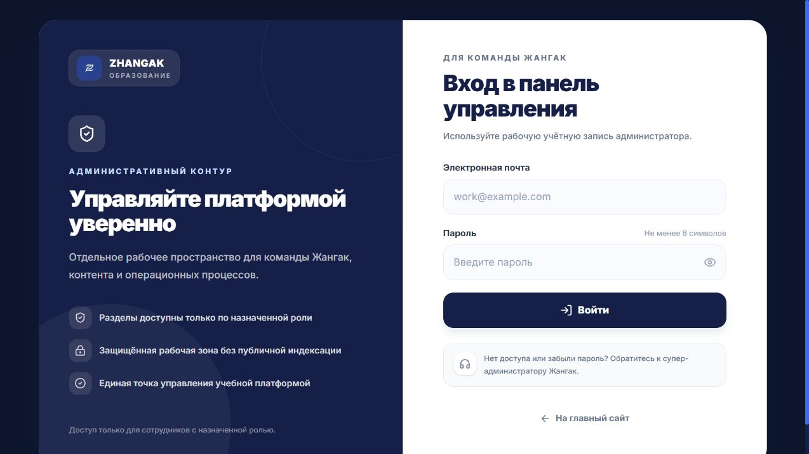
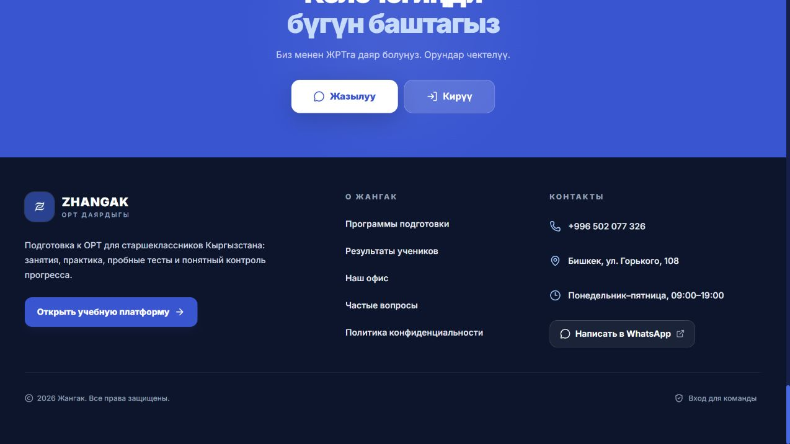

# UX-аудит трёх поверхностей Zhangak

Дата: 13 августа 2026 года. Проверены desktop 1440×900 и mobile 390×844. Аудит основан на реально отрисованных страницах локальной сборки и сетевой проверке трёх production-доменов.

## Проверенный путь

1. `zhangak.com` — первый экран, навигация, программы, результаты, офис, FAQ и футер.
2. `platform.zhangak.com` — вход ученика/преподавателя и мобильная оболочка ученика.
3. `admin.zhangak.com` — вход администратора и структура административной навигации.
4. Состояния без сессии, недоступный API, mobile/desktop breakpoints и клавиатурная доступность интерактивных элементов.

## Состояние до первого среза

Маркетинговый первый экран уже имел сильный брендовый образ, понятное обещание и реальные результаты учеников.

На мобильном первый экран сохранял ясную иерархию, но дальнейший маршрут в продукт не был разведён по ролям.

Критическая проблема входа: при недоступном auth API ученик и администратор видели только бесконечную «Загрузку», без формы и возможности повторить попытку.

В мобильной платформе одновременно отображались технические skeleton-блоки, перегруженная верхняя панель и два входа в AI — в нижней навигации и плавающей кнопкой.

## Что исправлено в этом срезе

- Три поверхности получили однозначную ответственность: `zhangak.com` — маркетинг, `platform.zhangak.com` — ученики и преподаватели, `admin.zhangak.com` — административные роли.
- Учитель перенесён с административного домена на учебную платформу на уровне страниц, API и role mapping.
- Созданы разные экраны входа для платформы и админки; форма остаётся доступной во время проверки сохранённой сессии.
- Auth-запросы получили тайм-аут и понятные состояния network error / rate limit / неверные данные.
- Административная оболочка и logout переведены на собственный backend Zhangak; доступ проверяется fail-closed.
- Административное меню сгруппировано, emoji удалены, несуществующая ссылка профиля убрана.
- Старый тонкий футер и отделённая PWA-карточка заменены полноценным footer landmark с навигацией, контактами, WhatsApp, платформой и служебным входом.
- В шапке лендинга добавлены высокоинтентные якоря; бургер, FAQ и выбор результатов стали доступны с клавиатуры; автопереключение результатов удалено; добавлен `prefers-reduced-motion`.
- На мобильной платформе скрыты desktop-метрики, убрана дублирующая плавающая AI-кнопка и добавлено объяснение во время загрузки плана.

## Новые контрольные экраны

## Оставшиеся риски

### P0 — публикация доменов

`platform.zhangak.com` и `admin.zhangak.com` разрешаются на `178.105.33.204`, но HTTPS сейчас завершается `ERR_SSL_UNRECOGNIZED_NAME_ALERT`, а HTTP возвращает nginx `403`. До публичного релиза нужно активировать tracked nginx-конфигурацию и выпустить сертификат, включающий apex и оба поддомена.

### P0 — единый backend учебной платформы

Собственный backend уже обслуживает auth и управление учётными записями. Однако уроки, группы, результаты, scoring и часть student/teacher UI всё ещё используют старый Supabase data/auth SDK. Следующий обязательный backend-срез: PostgreSQL schema для учебного домена, first-party endpoints, серверное оценивание и перенос student/teacher layouts. До этого нельзя считать платформу полностью мигрированной.

### P1 — мобильная информационная архитектура

`Университеты`, `Рейтинг` и `Настройки` всё ещё доступны только через desktop sidebar. Нужен пункт «Ещё» с мобильным sheet, сохранив четыре главных действия в нижней навигации.

### P1 — язык продукта

Маркетинг преимущественно кыргызский, кабинеты преимущественно русские. Нужен явный выбор `KY / RU` и правило «один язык на один экран»; сейчас часть student copy смешана.

### P1 — первый опыт ученика

Полноэкранное предложение установить PWA следует заменить ненавязчивым prompt после первого полезного действия. Отсутствующее задание дня не должно выглядеть доступным. Эти изменения зависят от переноса student data flow на собственный backend.

## Сильные стороны

- Брендовая палитра и логотип используются последовательно.
- Первый экран лендинга и реальные результаты создают доверие.
- Основные mobile touch targets не меньше 44 px.
- Новый вход ясно объясняет, для кого предназначен каждый домен.
- Административная зона визуально и смыслово отделена от ученической.

## Ограничения аудита

Полный authenticated journey с реальными уроками и группами не был доступен: production TLS поддоменов не настроен, а учебный data layer ещё не перенесён на собственный backend. Поэтому выводы о student/teacher data states основаны на реально отрисованных loading/error состояниях и статическом contract-аудите кода, без выдуманных данных.
